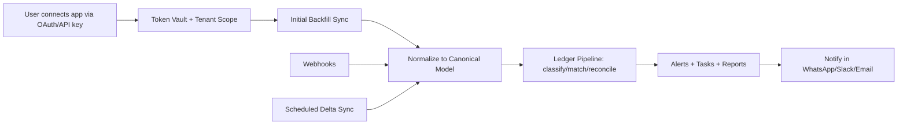

# Connector Platform + Sync Engine

## High-level flow

## Implemented components

- Product API (Next.js route handlers)
  - `POST /api/integrations/connect`
  - `POST /api/integrations/sync`
  - `POST /api/connectors/webhooks/:provider`
  - `POST /api/connectors/sync/delta`
  - `POST /api/connectors/notifications/dispatch`
- Connector service (in-app service module)
  - `lib/connector-sync-engine.ts`
- Queue/control-plane (Postgres-backed)
  - `job_runs`, `ingestion_runs`, `event_outbox`, `delivery_attempts`
- Idempotency ledger
  - `source_events` unique key: `(workspace_id, source, account_id, external_txn_id)`
- Normalizer/canonical model
  - `canonical_records`
- Token vault + sync state
  - `connector_tokens`, `connector_sync_cursors`, `connector_webhook_events`
  - Connection state fields on `integrations`:
    - `last_cursor`, `last_synced_at`, `backfill_status`, `error_state`

## Data safety guarantees

- Tenant-scoped rows include `workspace_id`
- New tables are RLS protected with `public.is_workspace_member(workspace_id)`
- Sync is idempotent using deterministic `source_events` keys and webhook dedupe keys
- Transaction ledger remains append-safe (no hard deletes)
- Hard delete on `transactions` is blocked by DB trigger (`trg_prevent_transactions_delete`)

## Runbook

1. Apply migrations
   - `npm run db:migrate`
2. Connect integration
   - `POST /api/integrations/connect`
3. Trigger sync
   - `POST /api/integrations/sync` (manual)
   - `POST /api/connectors/sync/delta` (scheduled delta)
4. Process notification outbox
   - `POST /api/connectors/notifications/dispatch`
5. Optional webhook ingest
   - `POST /api/connectors/webhooks/:provider`
6. Optional outbox delivery dispatch
   - `POST /api/connectors/notifications/dispatch`

## Signature verification (production)

- Razorpay:
  - Set `RAZORPAY_WEBHOOK_SECRET`
  - Send `x-razorpay-signature` header
  - Signature = `HMAC_SHA256(rawBody, secret)`
- Stripe:
  - Set `STRIPE_WEBHOOK_SECRET`
  - Send `stripe-signature` header
  - Signature v1 = `HMAC_SHA256("${timestamp}.${rawBody}", secret)`
  - Optional skew window: `STRIPE_WEBHOOK_TOLERANCE_SECONDS` (default `300`)
- Generic connector key fallback:
  - `CONNECTOR_WEBHOOK_SECRET` (or `CRON_SECRET`) via `x-connector-webhook-key`
  - Used for providers without native signature verification.
