# Trail System Design (Smooth-by-Default)

This document converts the product flow into an implementable backend operating model.

## 1) End-to-End Flow

```mermaid
flowchart TD
  subgraph SMB["SMB Founder / Finance Team"]
    U1["Uploads Data / Connects Tools"]
    U2["Receives Alerts + Reports"]
    U3["Asks Questions to Trail Agent"]
  end

  subgraph Tools["Where SMB Already Operates"]
    T1["Bank Accounts"]
    T2["Razorpay / Stripe"]
    T3["Invoicing Tools"]
    T4["Tally / Zoho Export"]
    T5["Payroll Systems"]
    T6["GST Portal Data"]
  end

  subgraph Integrations["Trail Integration Layer"]
    I1["Connectors + Imports"]
    I2["CSV Upload / API Sync"]
    I3["Continuous Data Fetch"]
  end

  subgraph Pipeline["Finance Data Pipeline"]
    P1["Transaction Parsing"]
    P2["Normalization + Cleanup"]
    P3["Categorization Rules"]
    P4["Ledger System of Record"]
  end

  subgraph Accounting["Trail Accounting Core"]
    A1["Reconciliation Engine"]
    A2["GST + Compliance Logic"]
    A3["Monthly Close Engine"]
  end

  subgraph Agent["Trail AI Finance Agent"]
    AG1["Business Context Memory"]
    AG2["Risk Detection + Reasoning"]
    AG3["Founder Q&A Engine"]
    AG4["Explainability + Audit Trail"]
  end

  subgraph Outputs["Customer Deliverables"]
    O1["Proactive Alerts"]
    O2["Monthly Finance Summary"]
    O3["P&L + Balance Sheet + Cash Flow"]
    O4["Plain-English Answers"]
  end

  subgraph Delivery["Where Trail Shows Up"]
    D1["WhatsApp Notifications"]
    D2["Email Reports"]
    D3["Dashboard"]
  end

  T1 --> I1
  T2 --> I1
  T3 --> I1
  T4 --> I1
  T5 --> I1
  T6 --> I1

  U1 --> I2
  I1 --> I3 --> P1
  I2 --> P1

  P1 --> P2 --> P3 --> P4
  P4 --> A1 --> A2 --> A3

  P4 --> AG1
  A2 --> AG2
  A3 --> AG2

  AG2 --> O1
  A3 --> O2
  A3 --> O3
  AG3 --> O4

  U3 --> AG3

  O1 --> D1
  O2 --> D2
  O3 --> D2
  O4 --> D1
  O1 --> D3
  O2 --> D3
  O3 --> D3

  D1 --> U2
  D2 --> U2
  D3 --> U2

  U2 --> AG1
```

## 2) Smooth Operation Principles

1. Idempotent writes everywhere.
2. At-least-once jobs + dedupe at consumer boundaries.
3. Ledger-safe accounting: never delete posted transactions.
4. Async side effects through outbox (alerts, WhatsApp, email).
5. Strong tenant isolation by `workspace_id` in DB + API auth.
6. Deterministic rules first, AI reasoning second.
7. LLM never touches raw financial math.

### Critical Finance Boundary

- LLM is limited to: understanding intent, routing to engines, explaining computed facts, suggesting actions.
- Structured finance engines must: compute numbers, validate outputs, enforce finance/compliance rules.
- Any LLM-facing payload should contain engine-computed facts only (no raw ledger math instructions).
- If a user asks a numeric question, orchestration must call deterministic tools first and only then let LLM explain.

### Reasoning Trace Contract

Every insight response should include a reasoning trace with these required fields on each step:

- `user_query`
- `tools_called`
- `inputs`
- `outputs`
- `timestamp`
- `confidence_score`

This contract applies across:

- `/api/insights/*`
- `/api/metrics/*`
- `/api/reports/*` (JSON responses) and audit logs for HTML/PDF report generation.

## 3) Service Contracts by Layer

### Integration Layer
- Input contract:
  - `workspace_id`, `provider`, `external_id`, `external_ref`, `occurred_at`, `amount`, `raw_payload`.
- Reliability:
  - unique dedupe key: `(workspace_id, provider, external_id)` when available.
  - fallback dedupe key: `(workspace_id, row_hash)`.
- Output:
  - persisted raw ingestion record + normalized transaction candidate.

### Parsing / Normalization
- Must produce canonical fields:
  - `direction`, `amount_minor`, `currency_code`, `occurred_at`, `description`, `counterparty`, `source`.
- Hard failures:
  - malformed date/amount.
- Soft failures:
  - missing narrative/counterparty -> still ingest with lower confidence.

### Categorization
- Stage order:
  - deterministic rule matches -> ML/AI optional.
- Store:
  - category decision, confidence, matched rule id, model version.

### Ledger (System of Record)
- Transaction lifecycle:
  - `pending -> posted -> reversed`.
- Safety rule:
  - no hard delete for posted; correction by reversal entry.

### Accounting Core
- Reconciliation:
  - suggestions + confidence + manual override.
- GST:
  - explainable formulas and component-level evidence.
- Monthly close:
  - reproducible from ledger snapshot + checks.

### Agent Layer
- Inputs:
  - ledger snapshot, compliance state, close state, alerts state.
- Outputs:
  - plain-English answer + cited evidence IDs + confidence.

## 4) Operational Control Plane (Required)

Use dedicated tracking tables for smooth operation:
- `ingestion_runs`
- `job_runs`
- `event_outbox`
- `delivery_attempts`

Why:
- replay-safe processing,
- observable failures,
- retries with audit trail,
- precise support debugging per workspace.

## 5) Idempotency and Deduping

- API mutation idempotency key header: `Idempotency-Key`.
- Import dedupe precedence:
  1. `(workspace_id, provider, external_id)`
  2. `(workspace_id, row_hash)`
- Outbox dedupe:
  - unique `(workspace_id, event_type, dedupe_key)`.

## 6) Retry Policy

- Connector fetch:
  - 3 retries with exponential backoff (2s, 8s, 30s).
- Delivery (WhatsApp/email):
  - 5 retries with jitter; dead-letter after max attempts.
- Rules + close jobs:
  - one active run per workspace per job type.

## 7) SLO / Error Budget

- Ingestion freshness: p95 < 10 minutes for connected providers.
- Alert latency: p95 < 5 minutes from qualifying event.
- Report generation: p95 < 30 seconds for monthly summary.
- API availability: >= 99.9% monthly for core read endpoints.

## 8) Security and Compliance

- Supabase RLS on all tenant tables.
- API scope verification via workspace membership.
- PII/token hygiene:
  - never store raw provider secrets unmasked in app DB.
- Audit logs for:
  - manual categorization, match overrides, reversals, alert actions.

## 9) Build Order (Execution)

1. Finalize control-plane tables + migration.
2. Route all async outputs through outbox.
3. Add per-workspace job locking and run tracking.
4. Add connector idempotency enforcement + ingestion metrics.
5. Add per-layer dashboards: ingestion, rules, accounting, delivery.
6. Add on-call runbook + replay scripts.

## 10) Done Criteria

- Every stage emits a run record.
- Every user-visible alert/report has traceable source transactions.
- Duplicate imports do not alter financial totals.
- Failed deliveries are retryable without duplicate customer spam.
- Cross-tenant reads/writes are impossible by policy and tests.
